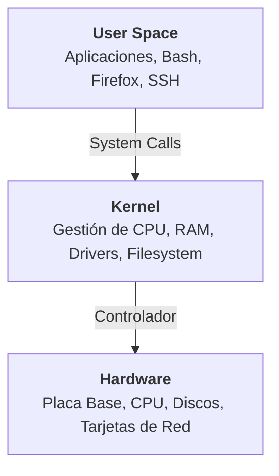

<div align="center">

#  Linux Introduction

*Una guía fundamental sobre el núcleo, la historia y la arquitectura del ecosistema GNU/Linux.*

</div>

---

##  Tabla de Contenidos

- [Introducción](#-introducción)
- [Historia de GNU y Linux](#-historia-de-gnu-y-linux)
- [Open Source y Software Libre](#-open-source-y-software-libre)
- [Arquitectura de un Sistema Linux](#-arquitectura-de-un-sistema-linux)
- [Distribuciones Linux](#-distribuciones-linux)
- [Gestión de Paquetes](#-gestión-de-paquetes)
- [Referencias](#-referencias)

---

##  Introducción

Cuando hablamos de **Linux**, normalmente hacemos referencia al ecosistema **GNU/Linux**, una combinación entre el núcleo Linux (Kernel) y las herramientas desarrolladas por el Proyecto GNU.

Actualmente, GNU/Linux es el motor de gran parte de la tecnología global. Se utiliza en:
*  **Servidores** e infraestructuras Cloud.
*  **Dispositivos embebidos** y como base de Android.
*  **Supercomputadoras** a nivel mundial.

---

##  Historia de GNU y Linux

###  El Proyecto GNU
Iniciado en **1983** por **Richard Stallman**, su objetivo era desarrollar un sistema operativo completamente libre inspirado en UNIX.

Durante años, la comunidad GNU desarrolló componentes que hoy son pilares fundamentales:
- `Bash` (Bourne Again Shell)
- `GCC` (GNU Compiler Collection)
- `Coreutils` y librerías del sistema
- Herramientas de administración y desarrollo

> **Nota histórica:** A pesar de tener casi todas las herramientas listas, el proyecto GNU aún carecía de un núcleo (kernel) funcional ampliamente adoptado.

###  Nacimiento de Linux
En **1991**, **Linus Torvalds** (estudiante de Ciencias de la Computación en la Universidad de Helsinki) comenzó el desarrollo de un núcleo propio inspirado en **MINIX** (un sistema educativo creado por Andrew Tanenbaum). 

Las limitaciones de licenciamiento y las capacidades reducidas de MINIX motivaron a Torvalds a programar su propia solución. Inicialmente el proyecto iba a llamarse **Freax**, pero posteriormente adoptó el nombre mundialmente conocido: **Linux**. La combinación del **Kernel Linux** y las **herramientas GNU** permitió, finalmente, construir un sistema operativo completo y funcional.

---

##  Open Source y Software Libre

Aunque suelen usarse como sinónimos, sus fundamentos filosóficos son distintos:

| Concepto | Filosofía Principal | Libertades / Permisos Clave |
| :--- | :--- | :--- |
| **Open Source**<br>*(Código Abierto)* | Promueve un modelo de desarrollo **pragmático** y colaborativo. | Permite a cualquier persona estudiar, modificar, mejorar y redistribuir el código fuente para fomentar la innovación. |
| **Software Libre**<br>*(Free Software)* | Impulsado por Richard Stallman, tiene un enfoque **ético** centrado en el usuario. | **1.** Ejecutar para cualquier propósito.<br>**2.** Estudiar cómo funciona.<br>**3.** Modificarlo.<br>**4.** Redistribuir copias y mejoras. |

---

##  Arquitectura de un Sistema Linux

Una forma sencilla de comprender Linux es visualizarlo como una serie de capas de abstracción:



###  Hardware
Es la base física del sistema. Incluye el procesador (CPU), la memoria RAM, los discos de almacenamiento, las tarjetas de red (NICs) y los periféricos de entrada/salida.

###  Kernel (El Núcleo)
Se ejecuta en memoria y tiene acceso privilegiado al hardware. Actúa como intermediario indispensable entre lo físico y lo lógico.
* **Responsabilidades:** Gestión de procesos, memoria, dispositivos, sistemas de archivos, networking y aislamiento de seguridad.

###  User Space (Espacio de Usuario)
Donde se ejecutan los programas que utilizamos diariamente (Bash, navegadores web, servidores web como Nginx/Apache). Las aplicaciones **no acceden directamente al hardware**, sino que solicitan recursos al Kernel mediante *System Calls*.

---

##  Distribuciones Linux

Una **distribución** (o *distro*) es un sistema operativo completo construido a partir del Kernel Linux, sumado a software adicional, gestores de paquetes y repositorios propios. 

Cada distro tiene un objetivo específico: *estabilidad, pentesting, uso doméstico, o servidores empresariales.*

###  Familia Debian
Caracterizada por su gran estabilidad, amplios repositorios y excelente documentación. Muy adoptada en servidores y en ciberseguridad.

```text
Debian
 ├── Ubuntu
 │    ├── Linux Mint
 │    ├── Pop!_OS
 │    └── Kubuntu
 ├── Kali Linux
 └── Parrot OS
```

###  Familia Red Hat
Fuerte presencia empresarial corporativa y certificaciones (RHCSA, RHCE) reconocidas mundialmente.

```text
Fedora
 └── RHEL (Red Hat Enterprise Linux)
      ├── Rocky Linux
      ├── AlmaLinux
      └── CentOS (Histórico)
```

###  Familia SUSE
Muy utilizada en entornos corporativos europeos e infraestructuras críticas.

```text
SUSE
 ├── openSUSE
 └── SUSE Linux Enterprise Server (SLES)
```

---

##  Gestión de Paquetes

Los gestores de paquetes permiten instalar, actualizar y eliminar software centralizadamente, resolviendo **dependencias** automáticamente.

| Familia de Distro | Formato | Herramientas CLI | Interfaces Gráficas (GUI) / Históricas |
| :--- | :---: | :--- | :--- |
| **Debian / Ubuntu** | `.deb` | `apt`, `apt-get`, `dpkg` | Synaptic, Software Center |
| **Red Hat / Fedora** | `.rpm` | `dnf`, `rpm` | `yum` (histórico), GNOME Software, Yumex |
| **SUSE** | `.rpm` | `zypper` | YaST |

---

##  Referencias

* **Linux Essentials** - CISCO / NDG
* **How Linux Works** - Brian Ward
* Documentaciones oficiales de **GNU** y **Linux**

---
<div align="center">
  <i>Escrito con fines educativos y de divulgación técnica.</i>
</div>
